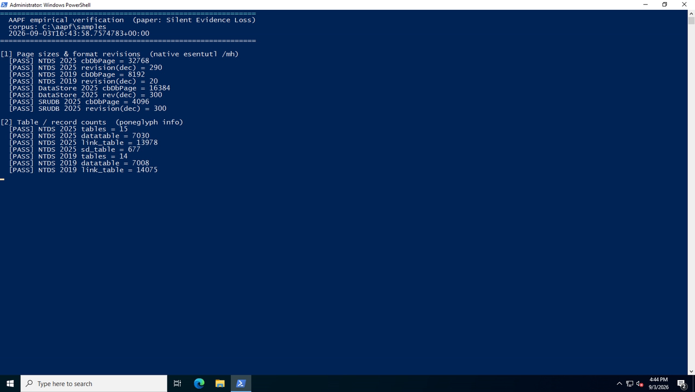
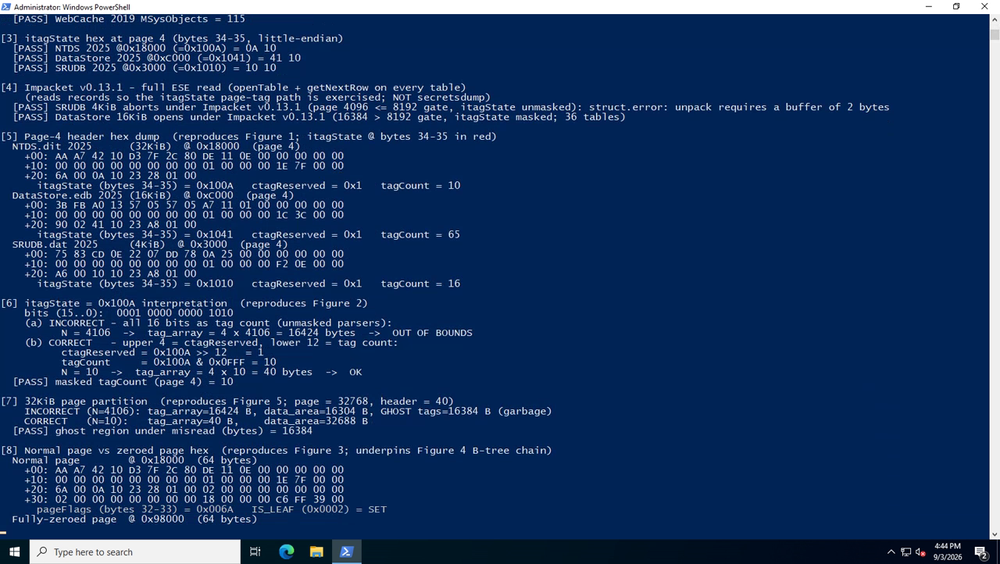
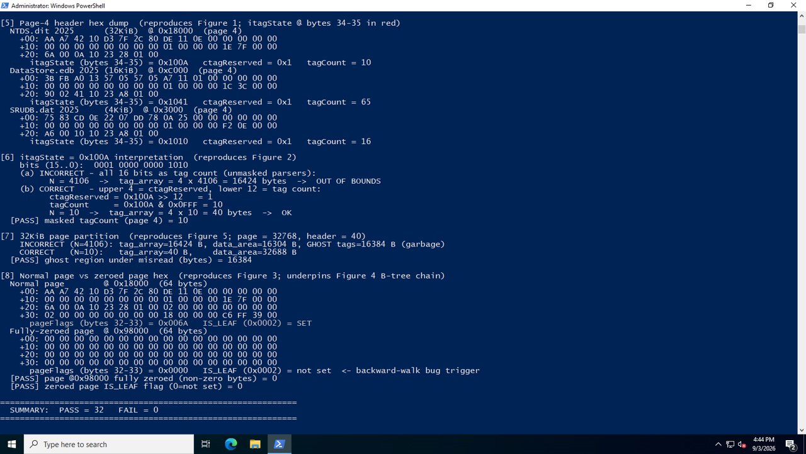

# Verification Evidence

This document records an **end-to-end, self-recording verification** of every
quantitative claim, table value, and figure in the paper *"Silent Evidence Loss
in Modern Windows"*, run against the deposited AAPF corpus inside a disposable,
network-isolated Windows sandbox.

Where [`REPRODUCE.md`](REPRODUCE.md) tells a reviewer **how** to reproduce each
result by hand, this file is the **captured result** of doing so automatically:
a single `vagrant up` builds a clean VM, runs the checks, and screen-records the
run to video. Every check is a hard PASS/FAIL assertion against a pre-declared
expected value; the run reproduced here yields **52 PASS / 0 FAIL**.

Everything below is regenerable from this record alone — see
[Regenerating this evidence](#regenerating-this-evidence).

## Environment

| Component | Value |
|---|---|
| Guest OS | Windows Server 2022 Standard (Vagrant box `gusztavvargadr/windows-server-2022-standard`) |
| Isolation | Private VM; no inbound network; corpus mounted read-only via HGFS |
| Parser under test (patched) | `poneglyph.exe` v0.2.3 (revision-gated `libesedb`) |
| Comparison parser | Impacket **v0.13.1** (`impacket.ese.ESENT_DB`) |
| Native cross-check | Windows `esentutl /mh` |
| Corpus | the `samples/` tree of this record (Clean state) |

## What each check maps to in the paper

| # | Verification section | Paper claim / figure / table | Result |
|---|---|---|---|
| [1] | Page sizes & format revisions (`esentutl /mh`) | Table 1, §2.2 page-size heterogeneity; §5.1 revisions (`0x0122`/`0x012C`/`0x0014`) | 8/8 PASS |
| [2] | Table / record counts (`poneglyph info`) | Table 5 (Schema Robustness × Clean), Table (Integrity) | 15/15 PASS |
| [3] | `itagState` at page 4 (bytes 34–35) | Table (`itagState` per artifact); Figures 1–2 | 3/3 PASS |
| [4] | Impacket v0.13.1 full ESE read | Tools/benchmark table; §8.4 (4 KiB `SRUDB` aborts, 16 KiB `DataStore` opens) | 2/2 PASS |
| [5] | Page-4 header hex dump | **Figure 1** (annotated ESE page header) | displayed |
| [6] | `itagState = 0x100A` bit-field interpretation | **Figure 2** (correct vs 16-bit misread) | 1/1 PASS |
| [7] | 32 KiB page partition | **Figure 5** (data area vs "ghost tags") | 1/1 PASS |
| [8] | Normal page vs fully-zeroed page hex | **Figure 3** (page comparison) + underpins **Figure 4** (B-tree leaf chain) | 2/2 PASS |
| [9] | Client axis (`w11-25h2`): the 4/16/32 KiB spectrum on one client | §8.5 client applicability; the deposited synthetic Windows 11 samples | 12/12 PASS |
| [10] | Credential value fidelity: Poneglyph vs Impacket, per RID | §8.3 value-fidelity cross-validation; `reproduction/hash_value_validation.txt` | 8/8 PASS |
| | **SUMMARY** | | **52 PASS / 0 FAIL** |

All values are read live from the deposited databases; none are hard-coded. In
particular [6]–[8] derive `4106` vs `10`, the `16 384`-byte ghost region, and
the zeroed-page `IS_LEAF` state from the actual page-4 header of
`samples/identity/2025/clean/ntds.dit`.

## Screenshots (frames extracted from the recording)

### 1 — Page sizes and record counts (sections [1]–[2])
Native `esentutl /mh` page sizes/revisions and `poneglyph info` counts, matching
Table 1 and Table 5.



### 2 — `itagState`, Impacket, and Figures 2/3/5 (sections [3]–[8], top)
`itagState` hex per artifact (all upper-nibble `ctagReserved = 0x1`), the Impacket
v0.13.1 result, the Figure 2 bit-field interpretation, the Figure 5 page
partition, and the Figure 3 *normal* page dump.



### 3 — Page hex comparison and final summary (section [8] + SUMMARY)
Figure 3's *normal* (`0x18000`) vs *fully-zeroed* (`0x98000`) page headers read
from the real sample — the zeroed page's `page_flags = 0x0000` (`IS_LEAF` not
set) is the exact condition behind the Figure 4 B-tree leaf-chain failure — and
the `SUMMARY: PASS = 52  FAIL = 0` line, and the `Negative controls: 3/3` line below it.



## Figure-to-hex correspondence (read from the deposited `ntds.dit`)

The illustrative page is page 4 (`0x18000 = 3 × 32768`) of
`samples/identity/2025/clean/ntds.dit`.

| Artifact (2025, Clean) | Page-4 offset | `itagState` bytes 34–35 | Value | `ctagReserved` | tag count |
|---|---|---|---|---|---|
| `ntds.dit` (32 KiB) | `0x18000` | `0A 10` | `0x100A` | `0x1` | 10 |
| `DataStore.edb` (16 KiB) | `0xC000` | `41 10` | `0x1041` | `0x1` | 65 |
| `SRUDB.dat` (4 KiB) | `0x3000` | `10 10` | `0x1010` | `0x1` | 16 |

- **Figure 2** — `0x100A` read as all 16 bits = `4106` → `tag_array = 4 × 4106 =
  16 424` B (out of bounds); read correctly = `ctagReserved = 1`, count = `10` →
  `40` B.
- **Figure 5** — on the 32 KiB page: misread leaves a `16 384`-byte "ghost tag"
  region of garbage; correct read leaves a `32 688`-byte data area.
- **Figure 3 / 4** — the fully-zeroed page at `0x98000` is 64/64 bytes `0x00`, so
  `page_flags = 0x0000` and `IS_LEAF (0x0002)` is not set — the trigger for the
  backward leaf-walk error the patch fixes.

## Full text log

The complete console transcript (all eight sections, UTF-16) is
[`verification-evidence/verification-final-32pass.log`](verification-evidence/verification-final-32pass.log).

## Video

The full screen recording of the run (`[1]`–`[8]` in a live console) is
`verification-evidence/verification-final-32pass.mp4`. It is distributed with the
**Zenodo record only** (kept out of the Git repository for size); the three
screenshots above are frames extracted from it.

## Regenerating this evidence

The sandbox that produced this record is included under
[`sandbox/`](sandbox/). On a Windows host with Vagrant and the VMware Desktop
provider:

```powershell
cd reproduction\sandbox
vagrant up            # builds the VM, installs Python/Impacket/ffmpeg, provisions auto-logon
# On first boot the VM reboots into the recorded run automatically; results appear
# on the host under reproduction\sandbox\output\ :
#   verification-<timestamp>.mp4   (screen recording)
#   verification-<timestamp>.log   (full transcript)
#   DONE.txt                       (completion sentinel)
vagrant halt          # or `vagrant destroy -f` to remove the VM entirely
```

The Vagrantfile mounts the extracted record root (`../..`) read-only at `C:\aapf`
inside the guest, so no host-specific path edits are needed when run from
`reproduction/sandbox/`. The verification script itself is
[`sandbox/scripts/run-verification.ps1`](sandbox/scripts/run-verification.ps1);
it is read-only with respect to the samples and never runs `secretsdump` — the
Impacket check exercises only the catalog/page-tag parse path.

### Notes

- The checks assert against the **Clean** state. Locked/Crashed states carry
  documented non-determinism (see [`REPRODUCE.md`](REPRODUCE.md) §Tolerance).
- Impacket is pinned to **v0.13.1** deliberately: that release added a
  `page_size > 8192` gate that masks `itagState` on 16/32 KiB pages but leaves
  the 4 KiB `SRUDB.dat` unmasked — hence the section [4] split result (16 KiB
  opens, 4 KiB aborts with `struct.error: unpack requires a buffer of 2 bytes`).
